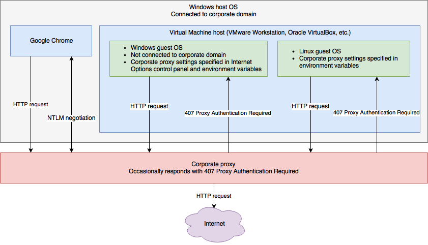
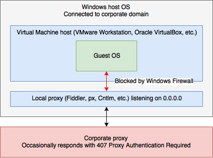
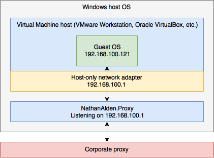

# NathanAlden.Proxy

NathanAlden.Proxy is a proxy server written in C# and .NET Core.

## Features

### Compatible with corporate domains and proxies, and restrictive Windows Firewall configurations

Consider the following scenario:
* A user's runs Windows as their host OS; Windows is connected to a corporate domain
* Domain policy force-enables Windows Firewall and may even disable the ability to customize the firewall's rules
* The corporate network forces the use of a corporate proxy to access internet HTTP resources
* The user runs local virtual machines that are not connected to the corporate domain, but still needs to access internet HTTP resources



Traffic from the user's host OS has no trouble authenticating with the corporate proxy because they are logged in to their domain account. Requests to the proxy from applications that support NTLM authentication (e.g., Google Chrome) can automatically authenticate when the proxy responds with `407 Proxy Authentication Required`. However, traffic originating from local VMs not connected to the domain cannot authenticate with NTLM. Depending on corporate proxy configuration, this can result in frequent `407 Proxy Authentication Required` responses, some of which may not be actionable, especially from CLI tools that do not support proxy authentication at all (e.g., Git). Proxy settings in the Internet Options control panel do not allow for specifying credentials. CLI tool proxy environment variables only support basic authentication usernames and passwords in clear-text--a security risk. Ideally, local VMs would never receive `407 Proxy Authentication Required` responses.

NathanAlden.Proxy can be configured to sit between local VMs and a corporate proxy. NathanAlden.Proxy automatically handles `407 Proxy Authentication Required` by responding with basic authentication credentials. Unfortunately, NTLM is not supported at this time due to the complexity of the NTLM handshake; however, many corporate proxies support basic authentication.

Many existing proxies already support forward proxies. Unfortunately, most of them only provide a binary option for binding to a local IP address: `127.0.0.1` and `0.0.0.0`. Binding to `0.0.0.0` when Windows Firewall is enabled can trigger Windows Firewall to block the listening socket, thus making it impossible for local VMs to communicate with the local proxy.



Since the local proxy only needs to handle traffic between the local VMs and the corporate proxy, it should be bound instead to a network adapter shared by all local VMs--usually, a so-called "host-only" network adapter.



With this configuration, NathanAlden.Proxy is resistant to Windows Firewall settings and automatically handles `407 Proxy Authentication Required` responses before they reach the local VMs. Local VMs never need to supply proxy credentials.

Example configuration:

```YAML
bindings:
  ipAddresses:
  - 192.168.100.1
  port: 3128

forwardProxies:
  http:
    host: proxy.corporatenetwork.com
    port: 80
    authentication:
      basic:
        enabled: true
  https:
    host: proxy.corporatenetwork.com
    port: 80
    authentication:
      basic:
        enabled: true
  noProxyHosts:
  - .corporatenetwork.com
```